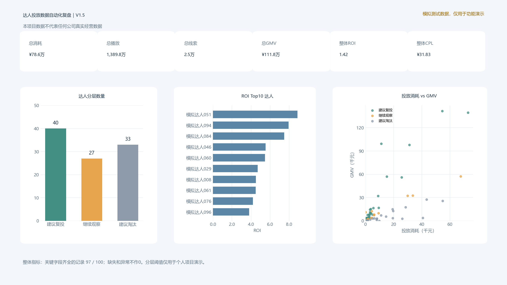

# 达人投放数据自动化复盘工具｜Codex CLI辅助开发

> 本项目所使用数据均为模拟测试数据，仅用于功能演示，不代表任何公司真实经营数据。

面向达人投放复盘场景的 Python 自动化工具，可完成数据清洗、指标计算、达人分层、质量检测，并自动输出 Excel 复盘报告与 PNG 数据看板。

## 效果预览



## 项目背景

达人投放复盘通常涉及大量 Excel 整理、指标计算、达人排序与复投判断，本项目尝试将重复数据处理流程自动化。

## 项目价值

将 CSV/Excel 数据自动转换为指标明细、达人排名、分层建议及可视化看板，减少重复整理步骤，让运营人员把更多时间用于策略判断。

## 项目结构

```text
data/                 模拟输入数据
src/config.py         可修改的演示分层阈值
src/main.py           生成数据、清洗、分析及 Excel 导出
src/dashboard_image.py 生成静态看板图片
tests/               自动化测试
output/              生成的复盘报告和图片
requirements.txt      Python 依赖
```

## 运行

建议使用 Python 3.8 或更高版本。在项目根目录执行：

```powershell
python -m pip install -r requirements.txt
python src/main.py --generate-sample
```

第二条命令会生成 `data/模拟达人投放数据_V1_5.csv`（100 条模拟记录）、`output/达人投放复盘报告_V1_5.xlsx` 和 2560×1440 的 `output/dashboard.png`。V1.0 的 `_V1` 文件会保留。已有模拟输入文件时：

```powershell
python src/main.py --input data/你的文件.xlsx --output output/我的复盘报告.xlsx --dashboard-image output/我的看板.png
```

也支持 `.csv`；CSV 优先按 UTF-8（含 BOM）读取，失败时尝试 GB18030。Excel 默认读取第一个工作表。输入至少需要以下列，列名应完全一致：

`达人名称`、`粉丝数`、`播放量`、`点赞数`、`评论数`、`转发数`、`投放消耗`、`线索量`、`成交量`、`GMV`。

修改输入文件或 [`src/config.py`](src/config.py) 中的阈值后，重新运行脚本即可刷新报告。

运行测试：

```powershell
python -m unittest discover -s tests -v
```

## 报告内容

1. **数据看板**：13 项核心指标、样本总数、有效记录数、待补数据数、异常记录数，以及三张简洁图表。
2. **整体数据明细**：原始字段、清洗后的数值、五项衍生指标及异常说明。
3. **达人表现排名**：按 ROI 排序，并显示 CPL、互动率名次；数据不完整者不参与排名。
4. **达人分层建议**：逐达人列出分层结果、具体原因、触发规则；缺失或异常的记录进入“继续观察 / 待补数据”。
5. **数据质量报告**：区分真实 0、缺失值、格式异常、非法负数，统计总量与各输入字段情况。
6. **整体复盘**：整体指标、总互动数、达人算术平均、样本覆盖数和计算口径。
7. **参数配置说明**：记录本次报告使用的五项演示阈值及其作用。

`dashboard.png` 使用同一份分析结果绘制 16:9 静态看板，便于作品集展示；更新输入后须重新运行脚本生成图片和 Excel。

## 计算口径

| 指标 | 计算方式 |
| --- | --- |
| 互动率 | （点赞数 + 评论数 + 转发数）÷ 播放量 |
| CPM | 投放消耗 ÷ 播放量 × 1000 |
| CPL | 投放消耗 ÷ 线索量 |
| 线索转化率 | 成交量 ÷ 线索量 |
| ROI | GMV ÷ 投放消耗 |

整体指标采用**汇总后再相除**的口径：整体 ROI = 总 GMV ÷ 总投放消耗；整体 CPM = 总投放消耗 ÷ 总播放量 × 1000；整体 CPL = 总投放消耗 ÷ 总线索量；整体互动率 = 总互动数 ÷ 总播放量；整体线索转化率 = 总成交量 ÷ 总线索量。

为避免未知值被当作真实 0，整体总量和比率只统计**达人名称及全部必需数值字段齐全的记录**。看板显示有效汇总记录数；不完整记录仍保留在明细和异常数量中。真实 0 保留为 0；分母为 0 时对应指标留空。达人算术平均 CPL 和互动率仅对有效记录中可计算的达人取算术平均，它们与整体汇总口径不同。

缺失值、无法识别的格式、非法负数，以及数量字段中的非整数，均在清洗后保留为 NaN（Excel 显示为空白）并记录异常；不会用 0 替代。可识别的千位逗号、空格、`¥`、`￥` 和 `$` 会被清理。输入文件不会被修改。

数据质量报告中，缺失、格式异常和负数按**单元格**计数；“真实0记录数量”按出现过真实 0 的**达人记录**去重计数。“异常记录数”则包含因分母为 0 而无法计算指标的记录。真实 0 本身不是缺失值。

## 达人分层：仅用于演示

阈值集中在 [`src/config.py`](src/config.py)，用户可直接修改后重新运行。**这些阈值仅用于个人项目功能演示，不代表任何公司真实策略或行业标准。**

默认规则依次判断：

1. 关键字段缺失或异常：继续观察，待补数据。
2. 播放量或投放消耗为真实 0：继续观察，先核对。
3. ROI ≥ 1.5、CPL ≤ 120、线索量 ≥ 5：建议复投。
4. ROI < 0.8，或 CPL > 250，或有消耗但无线索：建议淘汰。
5. 其余：继续观察。

100 条模拟记录中故意加入真实 0、空白、无法识别的文字和负数，便于演示边界处理。示例数据和输出报告均有“模拟测试数据”标识。

